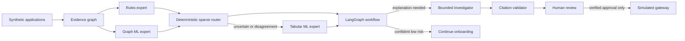

# MerchantShield

MerchantShield is a defensive merchant-onboarding risk investigator for the
Razorpay AI Buildathon. It finds groups of applications that may be controlled
together, explains the few shared signals that matter, and gives the final
decision to a human reviewer.

> Every identity, document, link, scenario and metric in this repository is
> synthetic. The measured results are not production Razorpay performance.

## Current status

The end-to-end **synthetic demonstration** is implemented and visually checked.
It is not a production deployment.

- The automated suite covers the detector, workflow, review API and UI interactions.
- `12/12` end-to-end acceptance checks pass.
- High-risk groups are held for a person; the default application cannot
  automatically reject or permanently blacklist a merchant.
- The demo runs without an API key in clearly labelled `LLM_DISABLED` mode.
- The onboarding gateway is simulated by default.
- The **Check merchants** section accepts pasted or uploaded synthetic merchant
  details and runs them through the real evidence graph, routed experts,
  bounded investigator and grounding checks without saving the submission.

## Run the demonstration

From the repository root:

```bash
./run.sh
```

The first run creates a local virtual environment, installs dependencies, and
seeds synthetic review cases. Then open:

- reviewer UI: `http://localhost:8501`
- API documentation: `http://localhost:8000/docs`

### Streamlit Community Cloud

Use `streamlit_cloud.py` as the **Main file path** when creating a Community
Cloud app. It starts the same FastAPI service on loopback, seeds the synthetic
review queue once, and then renders the normal reviewer UI. No secrets are
required: leave the app in `LLM_DISABLED` mode for the public demonstration.
Community Cloud storage is ephemeral, so uploaded CSVs and the SQLite case
database are not a durable production record. Keep the repository public (or
grant Streamlit access to a private repository), and never add `.env`, API
keys, real KYC documents, or customer data.

Run verification separately with:

```bash
.venv/bin/python -m pytest -q
.venv/bin/python scripts/acceptance.py
```

### Live merchant check

Open **Check merchants** in the top navigation. In three clicks you can choose
an example and run it:

- one new merchant that matches an existing synthetic ring;
- three new merchants that form a linked group;
- three independent merchants as a negative control.

An employee can also paste CSV rows or upload a `.csv` file containing these
columns:

```text
merchant_id,business_name,owner_name,bank_account,device_fingerprint,ip_address,registered_address,submitted_at
```

The live check accepts multiple CSV files in one batch, up to 1 MB and 100
submitted merchants in total. It compares those merchants with each other and the
frozen synthetic reference population. It returns the real routing and workflow
trace, but does not persist the input, create a final fraud verdict, blacklist a
merchant, authenticate documents, or call a gateway. Use synthetic details only.

For the recorded demonstration, upload all six files under
`demo_uploads/six_file_ring/` together. They reproducibly form one six-merchant
synthetic group with four corroborating similarity types. The timed narration
and screen directions are in `docs/FIVE_MINUTE_DEMO_SCRIPT.md`.

## Set up on a friend's laptop

The handoff ZIP is self-contained except for Python packages, which are
downloaded from `requirements.txt` on the first run. No API key is required for
the complete synthetic demonstration.

### macOS or Linux

Prerequisites: Python 3.11–3.13 and an internet connection for the first setup.

```bash
unzip MerchantShield-demo-ready-2026-09-04.zip
cd merchantshield
chmod +x run.sh
./run.sh
```

Keep that terminal open and visit `http://localhost:8501`. The first launch can
take a few minutes while dependencies are installed and the synthetic cases are
seeded. Later launches reuse the local environment and start much faster.

### Windows PowerShell

Prerequisites: Python 3.11–3.13 with the `py` launcher and an internet
connection for the first setup. Run these commands inside the unzipped
`merchantshield` folder:

```powershell
py -m venv .venv
.\.venv\Scripts\python.exe -m pip install --upgrade pip
.\.venv\Scripts\python.exe -m pip install -r requirements.txt
Copy-Item .env.example .env
.\.venv\Scripts\python.exe scripts\seed_cases.py
```

Keep the following API command running in the first PowerShell window:

```powershell
.\.venv\Scripts\python.exe -m uvicorn merchantshield.main:app --host 127.0.0.1 --port 8000
```

Open a second PowerShell window in the same folder and run:

```powershell
$env:MERCHANTSHIELD_API_URL = "http://127.0.0.1:8000"
.\.venv\Scripts\python.exe -m streamlit run merchantshield/ui/streamlit_app.py --server.port 8501
```

Then visit `http://localhost:8501`.

### If the site cannot be reached

- Confirm the launch terminal is still open and shows both the API and UI URLs.
- Wait for the first installation and seeding run to finish before opening the
  browser.
- Reload `http://localhost:8501` after the terminal prints the UI address.
- On macOS/Linux, if ports 8000 or 8501 are already occupied, run:

  ```bash
  MERCHANTSHIELD_API_PORT=8010 MERCHANTSHIELD_UI_PORT=8510 ./run.sh
  ```

  Then open `http://localhost:8510`.
- Do not copy an existing `.venv` from another computer. Virtual environments
  contain machine-specific paths; let the startup process create a new one.

## Three-click judge demonstration

1. Expand **Try a demonstration case**, keep **Evasive ring on held-out data** and
   click **Open demonstration case**.
2. Show the five linked merchants, the graph, the strongest similarity,
   coverage, submission window, legitimate alternative, and the investigator's
   evidence-linked explanation. Click **Confirm suspicious ring**.
3. Point out the explicit safety warning, then click **Confirm and finish**.

The result is a human-recorded hold for enhanced review—not a blacklist or
permanent rejection. Open **How MerchantShield reached this result** only if a
technical judge asks for routing or the audit trail. Use **Model validation** in the top bar to
show held-out metrics and the leakage-safe split.

For the quickest employee flow, use **Review next case →** on the review desk:
open the case, choose the decision, and confirm. The opening screen previews
the actual next ring. Additional cases are under **More in your queue**;
reviewer identity is under **Session**. The black-and-charcoal theme, Times New Roman typography, slim navigation,
and compact evidence panel use local fonts and need no external design assets.

For a false-positive story, choose **Shared kiosk: a false positive we do not
hide** and clear it using a verified legitimate explanation. This demonstrates
why high-risk results go to people instead of becoming automatic rejections.

## Architecture

MerchantShield is a system-level sparse mixture of experts, not a newly trained
neural MoE and not several chatbots debating one another.



| Part | What it owns | Main location |
|---|---|---|
| Deterministic rules | Obvious consistency signals | `merchantshield/agent/experts.py` |
| Graph analysis and ML | Linked-group construction and primary numerical score | `merchantshield/analysis/evidence_graph.py`, `merchantshield/evaluation/ring_models.py` |
| Tabular ML | Selectively routed second opinion | `merchantshield/evaluation/ring_models.py` |
| Sparse router and policy | Expert selection, numerical outcome, permitted action | `merchantshield/agent/router.py` |
| LangGraph | State, routing, bounded investigation and pause/resume | `merchantshield/workflow/` |
| Investigator | Evidence-bound explanation, alternatives, missing evidence or abstention | `merchantshield/investigation/` |
| Grounding validator | Rejects undisclosed or nonexistent evidence IDs | `merchantshield/investigation/grounding.py` |
| Persistence and review | Case lifecycle, version checks, events and human outcomes | `merchantshield/review/`, `merchantshield/db/` |
| Safe API | Case, demo and evaluation endpoints | `merchantshield/api/case_routes.py`, `merchantshield/api/demo_routes.py` |
| Reviewer UI | Two-surface, decision-first Streamlit workflow | `merchantshield/ui/streamlit_app.py` |

The project uses at most one LLM in the active workflow: the investigator.
Rules, models, graph construction, citation validation, scoring and permitted
actions remain ordinary deterministic or fitted code. An optional second
evidence-grounding LLM is not currently used because deterministic citation
validation is safer and sufficient for this demonstration.

## Synthetic data and evaluation

### Hard-ring investigation: rejected experiment, verification prompts added

The next experiment targeted the six previously missed evasive rings. Five
were slow submissions over weeks. The wider-context model uses bounded
multi-hop relationships, time gaps, identifier diversity and group-level
identity evidence without reading ring labels at prediction time. Eleven
validation candidates included group-size weighting and blends with v1. The
generator recipe and labels were unchanged; no label-dependent verification
fields were invented to improve results.

A new seed generated 6,082 synthetic applications: **3,654 training, 1,236
validation and 1,192 final-test**, with 73 test rings. Model/threshold choices
were locked before evaluating the new test. The previous test was development
evidence only, not reused as the claimed final test.

The candidate **failed adoption**, so neither existing cases nor the review
model were replaced. On the identical new test:

| Measure | V1, validation-retuned | Wider context |
|---|---:|---:|
| Precision | 61.2% | 59.0% |
| Merchant recall | 89.7% | 88.5% |
| False-positive rate | 33.9% | 36.7% |
| Ring recall | 91.8% (67/73) | 89.0% (65/73) |
| False risk flags | 253 | 274 |

The adoption checks required at least 80% merchant recall, 90% ring recall,
and no worse precision or false-positive rate than v1. Only the merchant-recall
check passed. This is a negative experimental result, not a performance gain.
The plan, all trials and the final metrics remain under
`data/evaluation/relationships/` (`plan.json`, `merchants.jsonl`, `report.json`).

In **Model validation**, choose **Hard-ring experiment** to see the failed
checks and the evasive/shared-infrastructure cohort breakdown; the previous
scoring comparison remains the default. The read-only endpoint is
`GET /api/v1/evaluation/report?dataset=relationships`.

Shadow scoring now supplies concrete **UNVERIFIED** relationship checklists:
settlement authority, ownership, authorized intermediaries and shared-office
tenancy. Network sharing alone is explicitly not proof of fraud. Inspect the
new candidate with
`GET /api/v1/evaluation/challenger/{candidate_id}?profile=relationships`.
This cannot modify a case, record verification, approve/reject a merchant or
call a gateway. Requests are not evidence that verification has occurred.

Wider context is capped at 50 merchants; exceeding the cap requires human
review even at a low risk score. Missing device/IP likewise never becomes a
clean approval. The benchmark verifies no capped components before using its
application-level metric adapter; the inference path handles capped cases
separately and fails safe.

To reproduce this **already-observed** experiment into a separate folder:

```bash
.venv/bin/python scripts/recover_hard_rings.py --stage tune --output-dir /tmp/merchantshield-hard-rings
.venv/bin/python scripts/recover_hard_rings.py --stage test --output-dir /tmp/merchantshield-hard-rings
```

The final test cannot be overwritten, and the loader checks source, data and
split integrity. Further development needs a new sealed protocol. Some slow
labelled rings and legitimate shared-infrastructure groups have overlapping
available evidence. Resolving that uncertainty requires independent verified
relationship evidence; simply strengthening the risk label would be unsound.

### Performance improvement (current validation page)

The improved **merchant/peer scoring engine** combines graph structure,
individual identity-rule signals, missingness, relative submission timing and
neighbour evidence. It learns individual labels rather than treating every
member of a suspicious component as equally guilty. A cheap graph model routes
ambiguous or conflicting applications to a gradient-boosted hybrid specialist.
Neither model uses identifier strings, cohort labels, declared components or
ring IDs as prediction features. No LLM is trained and no new agents are added.

The generator/labels were **not changed** to make this model look better. A
fresh seed of the same synthetic recipe produced 4,071 applications split by
whole components into **2,417 training, 813 validation, and 841 final-test**
applications. The final test contains **49 rings**. Four small model candidates
and their alert thresholds were compared on validation only; the selected plan,
dataset checksum and scoring-code checksum were locked before final testing.

Actual comparison on the **identical fresh test**, with all learned systems
trained on the identical training partition:

| System | Precision | Recall | PR-AUC | False-positive rate | Ring recall | Review rate | FP cost |
|---|---:|---:|---:|---:|---:|---:|---:|
| Original graph score, fixed threshold | 0.385 | 0.993 | 0.700 | 0.908 | 1.000 | 0.952 | 497 |
| Original graph, validation-tuned threshold | 0.541 | 0.814 | 0.700 | 0.394 | 0.898 | 0.679 | 302 |
| Original hybrid, validation-tuned threshold | 0.475 | 0.856 | 0.770 | 0.542 | 0.939 | 0.761 | 360 |
| New merchant/peer routed model | **0.612** | **0.824** | **0.835** | **0.299** | **0.878** | **0.648** | **267** |

False risk flags fell from **486 to 160**. The threshold-tuned legacy controls
show that this is not just a comparison of different alert thresholds: the new
model also improves ranking and precision over the tuned old graph model.
The original routed system uses this original graph score; the table's old
graph workload excludes its extra disagreement reviews, so the old workload is
a conservative comparison, not a rerun of all original router actions.

**The improvement is real within this synthetic test, but it is not a promotion
approval.** Merchant recall fell from 99.3% to 82.4%, and the new model flags
43/49 rings. Final ring recall of 87.8% misses the 90% development target.
The review desk therefore retains its frozen model and cases; the new model is
available for read-only shadow scoring. It does not change cases, approve a
merchant, reject or blacklist anyone, or call a gateway.

Validation selection minimized unnecessary-review cost plus missed-fraud cost
subject to at least 80% merchant recall and 90% ring recall. Default costs are
one unit each; these are development assumptions, not an approved risk policy.
A preliminary validation-only run used a missed-fraud cost of four units and
overfavoured recall; it was revised before the final test was scored. Missing
device/IP remains a review trigger even below the risk threshold, and those
legitimate reviews remain in workload/cost. 94.8% of final-test applications
still invoked the specialist: sparse routing currently saves little compute.

Artifacts:

- `data/evaluation/performance_merchants.jsonl`: fresh synthetic population.
- `data/evaluation/performance_plan.json`: locked training/validation/test IDs,
  validation trials, selected settings, cost assumptions and checksums.
- `data/evaluation/performance_report.json`: final metrics and cohort breakdowns.
- `merchantshield/evaluation/performance.py`: label-blind model and safe inference.

Reproduce into a **separate directory**; the test command refuses to overwrite
an existing final report and refuses changed code/data after tuning:

```bash
.venv/bin/python scripts/improve_risk_models.py --stage tune --output-dir /tmp/merchantshield-performance
.venv/bin/python scripts/improve_risk_models.py --stage test --output-dir /tmp/merchantshield-performance
```

These commands reproduce the same already-observed test seed, **not** a new
unseen evaluation. Further model development needs a genuinely new sealed
population/protocol. The API report is
`GET /api/v1/evaluation/report?dataset=performance`; shadow scoring for an
existing demo candidate is `GET /api/v1/evaluation/challenger/{candidate_id}`.
All identities remain synthetic. Both partitions share scenario families;
indistinguishable legitimate and fraudulent applications need additional
verified evidence, not stronger claims or more aggressive automatic decisions.

### How to explain the evidence in a demo

The validation page is an ablation, not a single opaque “AI score.” Every row
uses the same untouched, component-held-out applications: **Rules only** is the
deterministic control; **Clustering/Graph only** tests relationship evidence;
**Tabular only** tests merchant-level signals; **Graph ML** fits topology
features; **Hybrid** combines graph, tabular and peer context; and **Routed
MoE** selectively calls the specialists when graph uncertainty or rule
disagreement warrants it. The optional investigator/reviewer LLM is an
evidence narrator, never the owner of the score or an onboarding action.

The practical operating question is the threshold trade-off: a lower threshold
catches more labelled fraud but creates more legitimate reviews; a higher one
reduces false alarms but can miss a ring. The page shows the held-out rates,
false-positive counts, review workload and configured cost together, with the
threshold selected on validation data only. These are synthetic benchmark
results, not Razorpay production claims.

### How real onboarding data would map into this demo

In production, MerchantShield would consume fields already emitted by a KYC or
onboarding pipeline—not ask an employee to hand-author a CSV. The demo CSV is a
safe stand-in for that event contract:

| Demo field | Production source (illustrative) | Treatment in this repository |
|---|---|---|
| `merchant_id`, `submitted_at` | onboarding application/event log | synthetic IDs and timestamps |
| `owner_name`, `business_name` | verified KYC/business profile | synthetic names only; no document OCR |
| `bank_account` | payout/settlement verification | synthetic token; exact value is never shown to a model explanation |
| `device_fingerprint`, `ip_address` | risk telemetry/SDK | synthetic values; missing values force review |
| `registered_address` | KYC address record | synthetic address tokens; shared offices can be legitimate |

An adapter would normalize and hash/tokenize these signals before graph
construction, enforce retention and access controls, and attach independent
document-verification results. Those controls are intentionally out of scope
for this offline, synthetic demonstration.

### Previous expanded benchmark (preserved)

The larger labelled dataset is **`data/evaluation/expanded_merchants.jsonl`**.
It contains **2,002 synthetic applications, 720 independent groups and 120
labelled fraud rings**. The primary split uses **1,402 training applications
and 600 held-out applications**, including **35 unseen fraud rings**.

The five cohorts are ordinary legitimate merchants (400), legitimate shared
infrastructure (634), obvious labelled shells (372), harder-to-detect labelled
shells (396), and borderline legitimate merchants (200). Group sizes, submission
speeds and shared attributes overlap between legitimate and fraudulent labels.
The fixtures include partial links, innocent members within suspicious groups,
and missing device/IP observations. All email domains use reserved `.example`.

Rebuild the data and actually fit/evaluate the existing tabular, graph and
hybrid models across three preselected component-safe splits:

```bash
.venv/bin/python scripts/build_expanded_benchmark.py
```

The generator is `merchantshield/evaluation/expanded_dataset.py`. To create a
larger experimental population without replacing the checked-in benchmark:

```bash
.venv/bin/python scripts/build_expanded_benchmark.py --scale 2 --false-review-cost 10 --output-dir /tmp/merchantshield-benchmark
```

Scale is bounded to 1–10. Larger scales may take substantially longer. Models
are fitted in memory afresh for each split; **this does not train an LLM or
promote new models into the interactive review desk**. The demo still uses its
original frozen data and models to preserve the rehearsed scenarios.

`data/evaluation/expanded_report.json` contains all seven baselines, cohort
breakdowns, three complete split manifests, a dataset checksum, ring counts,
cost settings and split-sensitivity summaries. Labels and component IDs are
used for splitting/evaluation, not as model features. Whole observed connected
components, declared components and ring IDs are kept together, including
when missing observations disconnect members. Training sees only its partition;
the graph for evaluation is built from the held-out batch separately.

Actual primary-split results (seed `20250904`, 600 held-out applications):

| System | Precision | Recall | PR-AUC | FPR | Ring recall | Review rate | FP cost |
|---|---:|---:|---:|---:|---:|---:|---:|
| Rules only | 0.562 | 0.617 | 0.538 | 0.292 | 0.914 | 0.595 | 198 |
| Clustering only | 0.496 | 0.978 | 0.582 | 0.606 | 1.000 | 0.842 | 278 |
| Graph only | 0.508 | 0.863 | 0.633 | 0.509 | 0.971 | 0.780 | 256 |
| Tabular only | 0.377 | 0.947 | 0.658 | 0.952 | 1.000 | 0.968 | 363 |
| Graph ML | 0.393 | 0.991 | 0.723 | 0.930 | 1.000 | 0.960 | 349 |
| Hybrid | 0.396 | 0.987 | 0.795 | 0.914 | 1.000 | 0.958 | 348 |
| Routed MoE | 0.393 | 0.991 | 0.723 | 0.930 | 1.000 | 0.992 | 368 |

**These results expose excessive false alarms at the existing fixed threshold;
more data has not made the current system production-ready.** Routed MoE uses
the graph score, so its classification metrics match Graph ML; its additional
review triggers increase workload. Across the three splits, routed precision
ranges from 0.378 to 0.393. These are overlapping split-sensitivity checks, not
independent trials or confidence intervals.

Metric definitions matter:

- Precision/recall/FPR use a score greater than 0.25 as a screening flag, not a
  confirmed fraud decision. PR-AUC is average precision.
- Ring recall means **at least one** positive member was flagged, not that the
  entire ring was recovered.
- Review rate counts applications, not cases: all flagged applications,
  including high-risk ones, plus missing device/IP evidence. Routed MoE also
  counts its actual uncertainty/disagreement review triggers.
- Missing device/IP forces review in this **benchmark policy**; this change
  does not alter the live router. This conservative guard prevents missing
  observations being counted as clean approvals in the reported workload.
- False-positive cost is legitimate applications sent to review multiplied by
  the configured unit cost (default 1). It is not rupee-denominated and no
  autonomous rejection is modelled.

No thresholds or hyperparameters were selected using these test results. Any
next tuning milestone must introduce a **separate grouped validation set and
a new untouched final test**. The benchmark shares synthetic scenario families
across partitions, has designed rather than real prevalence, and evaluates a
complete batch rather than first-merchant detection or time-to-detection. Real
identity verification, real-world generalization and production calibration
remain unproven.

### Preserved 104-row demonstration

The original checked-in demonstration dataset remains:

```text
data/evaluation/synthetic_merchants.jsonl
```

It is reproducibly generated by `merchantshield/evaluation/dataset.py` and
contains 104 applications across legitimate merchants, legitimate
shared-infrastructure groups, obvious shell rings, evasive shell rings, and
borderline merchants.

The fixed split has 75 training and 29 held-out applications. Fraud-ring IDs
and connected components never cross partitions. The checked-in report is
`data/evaluation/latest_report.json`.

| System | Precision | Recall | PR-AUC | FPR | Ring recall | Review rate | FP cost |
|---|---:|---:|---:|---:|---:|---:|---:|
| Rules only | 0.455 | 0.500 | 0.672 | 0.316 | 0.500 | 0.207 | 6 |
| Clustering only | 0.500 | 1.000 | 1.000 | 0.526 | 1.000 | 0.345 | 10 |
| Graph only | 0.500 | 1.000 | 1.000 | 0.526 | 1.000 | 0.207 | 26 |
| Tabular only | 0.400 | 1.000 | 0.700 | 0.789 | 1.000 | 0.690 | 15 |
| Graph ML | 0.714 | 1.000 | 1.000 | 0.211 | 1.000 | 0.138 | 4 |
| Hybrid | 0.714 | 1.000 | 1.000 | 0.211 | 1.000 | 0.138 | 4 |
| Routed MoE | 0.714 | 1.000 | 1.000 | 0.211 | 1.000 | 0.138 | 4 |

This original synthetic benchmark is small and unusually separable. In particular,
`PR-AUC = 1.0` must not be interpreted as evidence of production readiness.
Its historical review-rate/cost definitions count only the middle score band
as manual review and model a hypothetical auto-reject band. They do **not**
describe the safe live application's actions and are not directly comparable
to the expanded benchmark's human-review-only workload. The old report remains
available at `/api/v1/evaluation/report?dataset=demo`; the default endpoint and
`?dataset=expanded` retain the expanded report for compatibility. The validation
UI now requests `?dataset=performance` for the fresh-test comparison above.

## Safety boundaries

- Missing, unreadable or unavailable evidence is never treated as clean.
- LLM output cannot set a numerical score or invoke an onboarding action.
- Fabricated citations are rejected deterministically and the case fails safe
  to human review.
- Case mutations require version checks and produce an append-only audit trail.
- Only a recorded human approval can reach a gateway.
- The original automatic-decision API remains available only as the isolated
  `legacy_app` test fixture; it is not mounted by the default server.
- `.env`, databases, uploads, Streamlit secrets and virtual environments are
  excluded from source control.

## Known limitations

- This is demo-ready on frozen synthetic data, not production-ready.
- The API has no production authentication, role-based access control or
  hardened deployment configuration.
- The workflow checkpointer is process-local; case records persist in SQLite,
  but distributed/resilient orchestration is not implemented.
- The live LLM path and Razorpay Partner test adapter require credentials and
  have not been validated as part of the offline acceptance run.
- A new ring's first merchant may have no cross-application link yet.
- Shared devices, addresses and networks can be legitimate, which is why the
  system measures false-positive cost and preserves human authority.

## Contributors

- **[@johan784](https://github.com/johan784) (Johan)** — product architecture, evaluation design, multi-file merchant-ring
  workflow, demonstration design, release validation and documentation.
- **[@lxhith24](https://github.com/lxhith24)** — application integration,
  deployment, repository management and implementation support.

MerchantShield was developed collaboratively for the Razorpay AI Buildathon.

Built for the Razorpay AI Buildathon.
